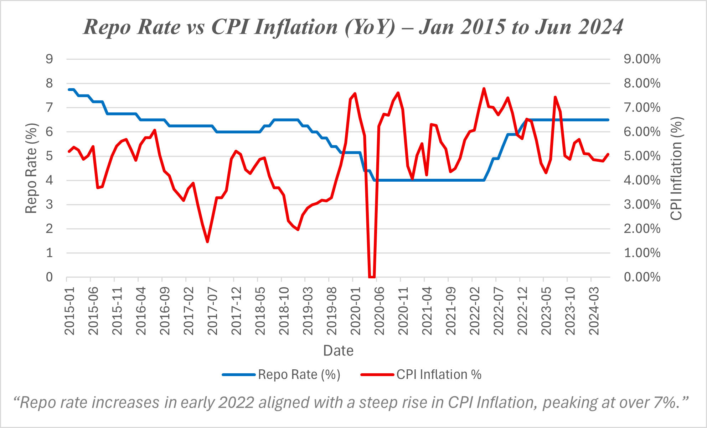
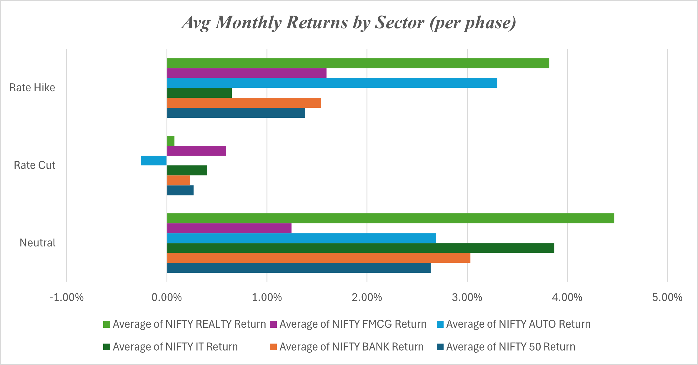
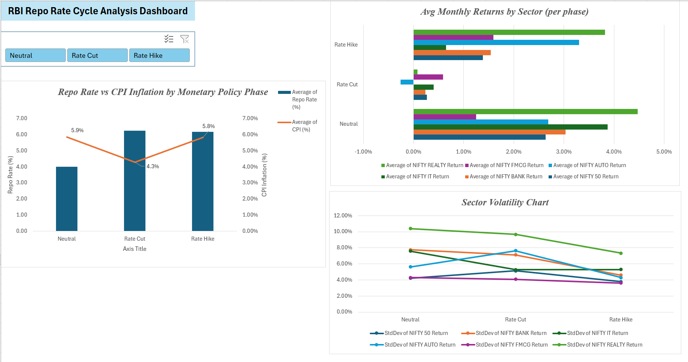

# Impact of Repo Rate Changes on Inflation and Sectoral Market India (2015–2024)

📊 A data-driven analysis of how the Reserve Bank of India's (RBI) monetary policy—specifically repo rate changes—impacts inflation trends and the performance of major stock market sectors. This project spans from 2015 to 2024 and includes interactive dashboards, visual analysis, and a focused COVID-19 module.

---

## 🎯 Objectives

- Analyze the relationship between repo rate changes and CPI inflation over time.
- Study the impact of rate cut, hold, and hike cycles on key sectoral indices.
- Measure lag effects between policy actions and market/inflation responses.
- Evaluate sector behavior and recovery during the COVID-19 monetary easing cycle.

---

## 🧾 Project Scope

- **Timeframe:** January 2015 – June 2024
- **Sectors Covered:** Nifty 50, Bank, FMCG, Auto, IT, Realty
- **Macro Indicators:** Repo Rate, CPI Index, CPI Inflation (%)
- **Phases Analyzed:** Rate Cut, Hold, and Rate Hike cycles
- **Focus Module:** COVID-19 crash and recovery (Mar 2020 – Mar 2021)

---

## 📂 Repository Contents

| File/Folder                   | Description                                                |
|-------------------------------|----------------------------------------------------------- |
| `Final_Report.pdf`            | Full report with insights, visuals, and conclusion         |
| `Master_Data.xlsx`            | Cleaned and merged dataset (repo, inflation, sectoral data)|
| `Sectoral_Index_Data.xlsx`    | Sectoral Indices data between Jan 2015 to Jun 2024         |
| `CPI_Index_And_Inflation.xlsx`| CPI and Inflation data between Jan 2015 to Jun 2024        |
| `Repo_Rate_Timeline.xlsx`     | Repo Rates for the desired timeframe                       |
| `images/`                     | Folder containing dashboard and chart images               |

---

## 📈 Key Insights

- CPI inflation responds to repo rate changes with a **2–4 month lag**.
- **Banking and Auto** are most sensitive to monetary cycles; **FMCG and IT** are more resilient.
- COVID-19 revealed the limits of monetary policy: inflation remained high despite rate cuts.
- Sectoral recovery was uneven, with **IT and FMCG** leading the post-COVID rebound.
- Interactive Excel dashboard enhances exploration of sector performance by phase.

---

## 📊 Visual Highlights

### 🔁 Repo Rate vs CPI Inflation

This chart visualizes how CPI inflation moves in relation to RBI's policy rate, highlighting lag effects and COVID-era anomalies.

---

### 📊 Sectoral Returns by Policy Phase

Displays average monthly returns of major sectors during rate cut, neutral, and rate hike periods.

---

### 🧭 Interactive Dashboard (Excel Preview)

A slicer-based dashboard lets users interactively explore sector performance across different monetary policy regimes.

---

## 🛠️ Tools Used

- **Excel:** Pivot tables, dashboards, visualizations
- **Sources:**
  - RBI (https://rbi.org.in)
  - MOSPI (https://mospi.gov.in)
  - NSE India

---

## 📄 Access the Full Report

👉 [Download Final Report (PDF)](Final_Report.pdf)

Includes all charts, methodology, COVID-19 analysis, and concluding insights.

---

## 🧠 Author Note

This project was developed independently as a self-taught exploration into macroeconomic data analysis, equity markets, and financial storytelling. It reflects both technical and analytical thinking, despite a non-commerce academic background.

